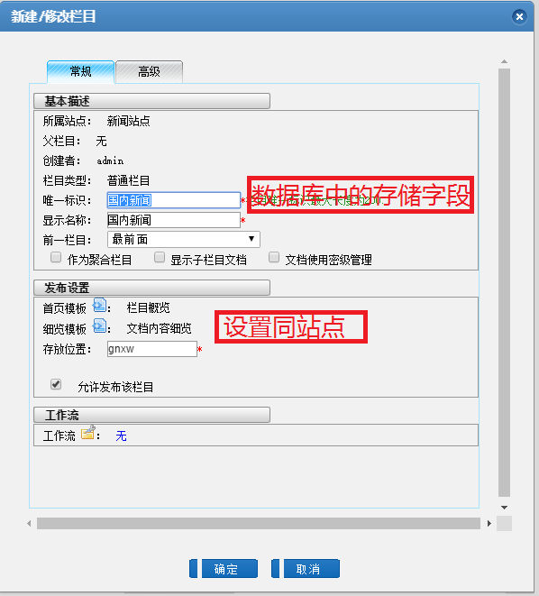
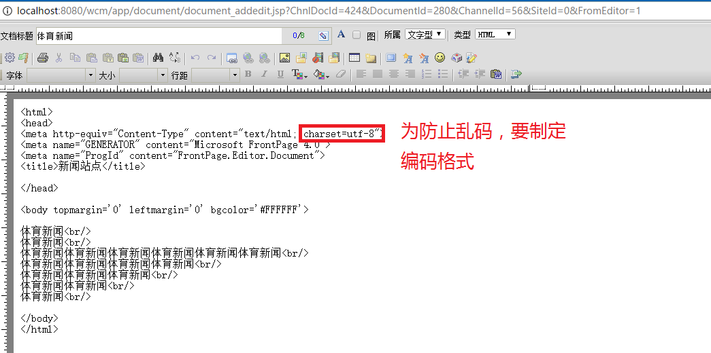
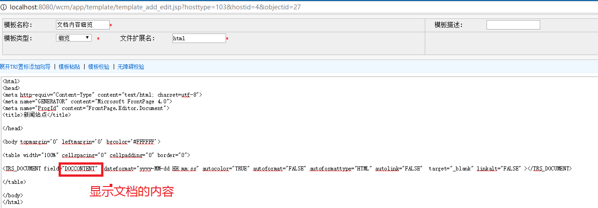

# Study3
WCM相关知识

## WCM简介
  WCM是统一的内容平台，全面覆盖企业内容应用。利用 WCM 可以轻松创建企业内部站点、外部资源门户、企业信息管理平台、企业协作平台等。
  
### 基本概念
  
  库：相同类型站点的集合，分为文字库、图片库、视频库和资源库。
  
  站点：WCM系统中最主要的对象，负责管理和组织栏目，一个站点相当于一个Internet网站，你可以通过一个网站的结构来设计站点及栏目。
  
  栏目：站点的下一级管理单元，用来组织和管理文档，栏目的存在必须依附于一个站点，没有站点便不能创建栏目。
  
  文档：WCM 系统的基本单元，也是系统的核心数据内容。系统的每一篇文档都必须建立在某一个栏目下，由具备特定权限的用户来操作和管理。
  
  模板：带有TRS标置的HTML文件，用来控制发布页面的显示，系统中的站点、栏目、文档都可以配备不同类型的模板。
  
  发布：将系统中的数据结合模板置标生成HTML页面的过程。设置了完整发布属性的站点、栏目、文档都可以直接进行执行发布操作。
  
  预览：在对象发布之前，可以通过预览查看站点、栏目、文档发布之后的效果。
  
  元数据：描述一个对象的属性的集合，类似数据库中表的概念。例如：政府信息公开可以是一个元数据，它可以是由标题、正文、发布机构，所属类别等属性组成。 
  
  视图：建立在元数据之上、由元数据生成的属性的集合，类似数据库中视图的概念。 
  
  单表视图：由单个元数据创建而成的视图。 
  
  多表视图：由多个元数据创建而成的视图。 
  
  主表：在创建多表视图的过程中，被选择为主要存储信息的元数据。 
  
  元数据字段：元数据的属性，类似数据库中表中字段的概念。 
  
  视图字段：视图的属性，类似数据库中视图中字段的概念。 
  
  分类法：用于标识数据的一颗分类树，如按体裁分类，按机构分类。 
  
## TRS置标说明
    
    置标的主要作用是控制数据在模板中的表现形式，将数据与表现分开。
    主要思路是TRS置标处理数据的内容，存放的位置以及如何存放等，
    数据的表现形式则由标准的html语言描述，
  
```html
<FONT COLOR=RED>
<TRS_DOCUMENT FIELD="DOCTITLE">这里放置文档标题</TRS_DOCUMENT>
</FONT>
```
  其中：第二行是TRS置标，其他部分是标准的HTML置标。TRS置标表明要在该位置放置字段名为"DOCTITLE"的字段内容。
  
## 根据系统的需要和使用方便，在TRS WCM系统的置标中采用了四种类型的置标，
  
  概览置标
  
  主要用于表示一个循环的属性，例如 TRS_DOCUMENTS、TRS_CHANNELS、TRS_RELNEWS 等。 
  
  细览置标
  
  主要用于引用某个具体的数据库字段，例如TRS_DOCUMENT、TRS_CHANNEL等
  
      TRS 置标统一以“<TRS_” 开头（置标名、属性名与大小写无关），<TRS_XXX>与</TRS_XXX>应成对出现，其中细览置标可以这样撰写
      <TRS_XXX FIELD=”***”/>。<TRS_XXX>与</TRS_XXX>之间的内容在生成页面时，将被数据库的输出内容所替代。
      每个置标都可以有多个置标属性，以实现不同的控制目的。XXX 表示当前所取的对象类型，比如文档置标就是 DOCUMENT；
      最后的字母为 S 表示是一个概览置标，获取的是一个循环。 
    
      其中 ID 属性表示当前置标所代表的对象从哪个地方获取；例如 TRS_DOCUMENTS中的 ID 表示的是从哪个栏目获取文档集合；
      FIELD 属性表示当前置标获取的是对象的那个属性，和数据库字段一一对应；
      例如<TRS_DOCUMENT FIELD=”DOCTITLE”/>表示获取的是当前文档的标题属性。

### WCM 测试用例：
  1、新建一个站点：
  

    
  2、并在站点下新建栏目
  

  
  3、然后再栏目下新建文档。编辑完毕之后，记得要保存并发布
  

  
  4、新建站点栏目概览模板：
  


  5、新建栏目概览模板：


  6、新建栏目的细览模板：


 
  7、效果图


  
  
